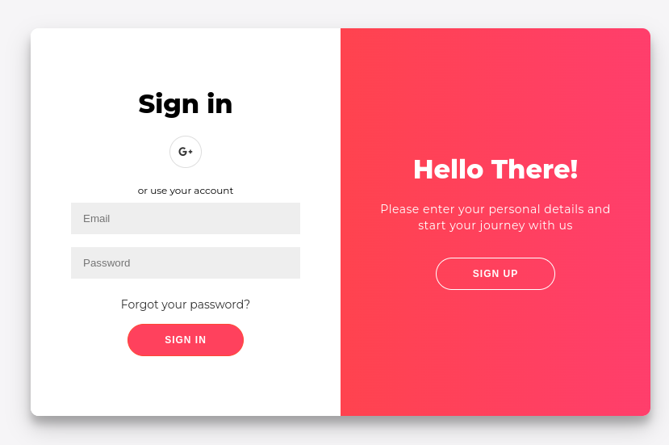
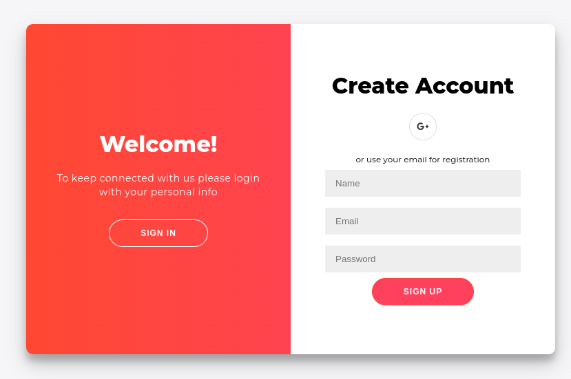
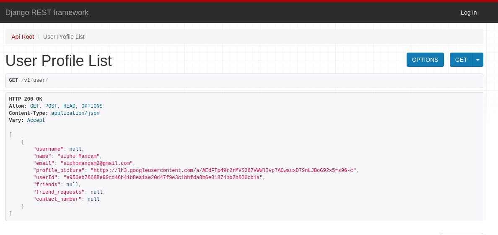

# IAM Service

The IAM Service is a means to try and reduce development time and improve security involved in Identity and Access Management, in addition to security and time, it hopes to
make the integration of social authentication much simpler by means of redirections.
and few API calls.

# Objectives
After having developed a fair amount of applications, I have come to realise that certain tasks in the app development process are fairly repetitive among applications, like user authentication and management, and the process is the same. This project looks to:

- Effectively remove the need to write the backends for User Authentication and Management.
- Reuse code accross projects without duplicating files.
- Reduce Hosting Costs in MS architectures. 
- Improve user experience by allowing data consistency across applications, so users only ever have to fill forms once and update info once and it will be propagated across applications that they have subscribed to.

# Tech Stack

This project at the time of this writing I'm currently running on this tech stack:

* Django Framework
* Django REST Framework
* Javascript
* HTML and CSS
* Google API Client
* SQLite3 (To Be updated to more scalable DBMS.)

# **Build**
The process for this application is fairly straight forward, what you need to do is:

**Requirements:**
    
    1. Python3.10
    2. git or and svc that can pull github repositories

**Build**
    
    git clone https://github.com/sipho-mancam/IAM_service.git

    cd IAM_service \

    python3.x -m venv .venv \

    source ./.venv/bin/activate \

    pip install -r requirements.txt \

    cd ./src/iam_rest_service \

    python manage.py runserver  \
    
    # open browser navigate to localhost:8080 

    # Yippiii!!!! You have succesfully built the service and it's ready to run.

# Usage

    In the Browser:
    
    Select Login or Sign In fill in the info and proceed.
    The resulting Unique userId will be relayed back to you as part of the URL argument.

    access the API:
        localhost:8080/v1/user/{userId} -> You will receive JSON Rep of the User Info.

# Preview

# Remarks

From this project I learnt the following:

1. How to user the django-rest framework using routers and class based views   with serializers
2. Using the Google Rest API to access user information and authenticating users with OAuth2 screen.
3. Learnt how the django Framework works.
4. How to use the Django Templating Engine,
5. Using Django Models and Admin Console.
6. I can safely say, this was a good introduction to the Django Framework.

> TO DO

* Improve Security in the API (API Keys, etc.)
* Expose more Resources on the API.
* Group Data Based On App Instances.
* Add More Social Auth.
* Register Apps
